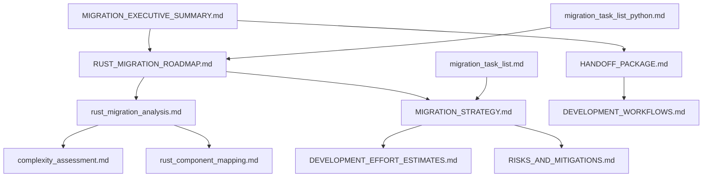

# OPNsense Config Faker - Rust Migration Documentation Index

## Project Overview

This directory contains comprehensive documentation for migrating the **OPNsense Config Faker** from Python to Rust. The migration aims to achieve 100% functional parity while delivering significant performance improvements (3-5x), enhanced type safety, better memory efficiency, and cross-platform reliability.

### Migration Status

- **Current State**: Planning complete, ready for implementation
- **Approach**: Phased migration through 8 milestones (v0.1 → v1.0) over 12-16 weeks
- **Benefits**: Performance improvements, single binary distribution, compile-time safety
- **Target**: Production-ready Rust implementation with full OPNsense compatibility

---

## 📁 Directory Structure

```text
rust_migration/
├── 📋 Core Planning Documents
│   ├── MIGRATION_EXECUTIVE_SUMMARY.md    # High-level strategic overview
│   ├── RUST_MIGRATION_ROADMAP.md         # Detailed roadmap and timeline
│   └── migration_task_list_python.md     # Original Python migration tasks
│
├── 🔍 Technical Analysis
│   ├── rust_migration_analysis.md        # Comprehensive technical assessment
│   ├── complexity_assessment.md          # Component complexity analysis
│   └── rust_component_mapping.md         # Python-to-Rust mapping
│
├── 📋 Implementation Strategy
│   ├── MIGRATION_STRATEGY.md             # Milestone-based implementation plan
│   ├── DEVELOPMENT_EFFORT_ESTIMATES.md   # Time and resource estimates
│   └── RISKS_AND_MITIGATIONS.md         # Risk analysis and solutions
│
├── 🤝 Stakeholder Communication
│   └── HANDOFF_PACKAGE.md               # Executive handoff and decision matrix
│
└── 📚 Reference Materials
    ├── DEVELOPMENT_WORKFLOWS.md          # Development processes and tools
    ├── migration_task_list.md            # Detailed task breakdowns
    └── SECTION_*_DRAFT.md                # Working draft sections
```

---

## 🎯 Quick Navigation by Role

### 👔 For Executives and Project Managers

**Start Here**: [`MIGRATION_EXECUTIVE_SUMMARY.md`](MIGRATION_EXECUTIVE_SUMMARY.md)

- Strategic value proposition and business impact
- Cost-benefit analysis and ROI projections
- Resource requirements and timeline overview
- Success metrics and risk assessment

**Next**: [`handoff/HANDOFF_PACKAGE.md`](handoff/HANDOFF_PACKAGE.md)

- Decision matrix for XML validation approaches
- Prerequisites and milestone planning
- Success criteria and communication plan

### 🏧️ For Technical Leads and Architects

**Primary**: [`analysis/rust_migration_analysis.md`](analysis/rust_migration_analysis.md)

- Comprehensive technical architecture assessment
- Performance analysis and ecosystem validation
- Current Python implementation deep-dive
- Rust implementation strategy and crate selection

**Supporting**: [`analysis/complexity_assessment.md`](analysis/complexity_assessment.md)

- Component-by-component complexity evaluation
- Risk factors and implementation difficulty ratings

### 👨‍💻 For Development Teams

**Implementation Guide**: [`strategy/MIGRATION_STRATEGY.md`](strategy/MIGRATION_STRATEGY.md)

- Detailed milestone breakdown (v0.1 through v1.0)
- Success criteria and acceptance testing
- Component-by-component migration plan
- Quality gates and validation requirements

**Resource Planning**: [`strategy/DEVELOPMENT_EFFORT_ESTIMATES.md`](strategy/DEVELOPMENT_EFFORT_ESTIMATES.md)

- Person-hour estimates by component
- Single vs. two-developer scenarios
- Timeline projections and parallelization strategy

**Risk Management**: [`strategy/RISKS_AND_MITIGATIONS.md`](strategy/RISKS_AND_MITIGATIONS.md)

- Technical risks and mitigation strategies
- Code examples for risk mitigation
- Cross-platform compatibility considerations

### 📚 For Reference and Support

**Development Workflows**: [`reference/DEVELOPMENT_WORKFLOWS.md`](reference/DEVELOPMENT_WORKFLOWS.md)

- Justfile tasks and CI/CD setup
- Quality assurance processes
- IDE configuration and tooling

---

## 🗺️ Migration Roadmap Overview

### Phase 1: Foundation (v0.1-v0.2) - 4 weeks

- **v0.1**: Core CSV/CLI framework with clap
- **v0.2**: XML generation capabilities and template system
- **Focus**: Establish basic architecture and data generation

### Phase 2: Validation & Performance (v0.3-v0.4) - 4 weeks

- **v0.3**: Cross-component validation and uniqueness engine
- **v0.4**: Rayon concurrency and performance benchmarks (TR001/TR002)
- **Focus**: Ensure data integrity and meet performance targets

### Phase 3: Schema Compliance (v0.5) - 2-3 weeks

- **Decision Point**: XSD validation vs. pure Rust typed models
- **Focus**: OPNsense configuration compliance and validation

### Phase 4: Feature Completion (v0.6-v0.7) - 6 weeks

- **v0.6**: NAT, firewall, CARP, and RADIUS features
- **v0.7**: VPN support (WireGuard, OpenVPN, IPSec)
- **Focus**: Complete feature parity with Python implementation

### Phase 5: Production Ready (v1.0) - 2 weeks

- **Focus**: Documentation, UX polish, cross-platform builds, release automation

---

## 📊 Key Metrics and Success Criteria

### Performance Targets

- **TR001**: Generate 1000+ VLAN configurations in \<2 seconds
- **TR002**: Process enterprise-scale configs (10K+ objects) in \<30 seconds
- **Memory**: 40-60% reduction compared to Python implementation
- **Overall**: 3-5x performance improvement

### Quality Standards

- **Code Coverage**: ≥80% core functionality, ≥90% critical paths
- **Linting**: Zero warnings with `cargo clippy -- -D warnings`
- **Cross-Platform**: Verified builds on Linux/macOS/Windows
- **Compatibility**: 100% functional parity with Python implementation

### Development Timeline

- **Single Developer**: 4.2-7.2 weeks (127-218 person-hours)
- **Two Developers**: 2.2-3.6 weeks (parallel development)
- **Buffer**: 20% contingency for integration challenges

---

## ⚠️ Critical Risk Areas

### High-Risk Components

1. **XML Schema Compliance**: OPNsense validation complexity
2. **XSD Validation**: Limited Rust ecosystem compared to Python lxml
3. **Feature Parity**: Ensuring 100% Python compatibility

### Medium-Risk Components

1. **CLI/UX**: Terminal compatibility and Rich-equivalent functionality
2. **Validation Engine**: Cross-component consistency checking
3. **Concurrency**: Rust ownership model adaptation

### Mitigation Strategies

- Early validation with sample OPNsense configurations
- Incremental benchmarking and performance monitoring
- Comprehensive integration testing throughout development
- Feature flags for gradual rollout of complex components

---

## 🛠️ Technology Stack

### Core Dependencies

- **CLI**: `clap` v4 with derive API
- **XML**: `quick-xml` with `serde` integration
- **Networking**: `ipnet` for RFC 1918 compliance
- **Data**: `serde` for serialization, `rand` for generation
- **Error Handling**: `thiserror` + `anyhow`

### Development Tools

- **Testing**: `rstest`, `criterion` benchmarking, `insta` snapshots
- **CI/CD**: GitHub Actions with cross-platform validation
- **Quality**: `clippy` with strict warnings, automated formatting

---

## 🚀 Getting Started

### For New Team Members

1. **Orientation**: Start with [`README.md`](README.md) for overview
2. **Technical Context**: Review [`analysis/rust_migration_analysis.md`](analysis/rust_migration_analysis.md)
3. **Implementation Plan**: Study [`strategy/MIGRATION_STRATEGY.md`](strategy/MIGRATION_STRATEGY.md)
4. **Development Setup**: Follow [`reference/DEVELOPMENT_WORKFLOWS.md`](reference/DEVELOPMENT_WORKFLOWS.md)

### For Stakeholders

1. **Executive Summary**: [`MIGRATION_EXECUTIVE_SUMMARY.md`](MIGRATION_EXECUTIVE_SUMMARY.md)
2. **Decision Package**: [`handoff/HANDOFF_PACKAGE.md`](handoff/HANDOFF_PACKAGE.md)
3. **Risk Assessment**: [`strategy/RISKS_AND_MITIGATIONS.md`](strategy/RISKS_AND_MITIGATIONS.md)

### For Implementation

1. **Architecture**: [`analysis/rust_migration_analysis.md`](analysis/rust_migration_analysis.md)
2. **Milestones**: [`strategy/MIGRATION_STRATEGY.md`](strategy/MIGRATION_STRATEGY.md)
3. **Effort Planning**: [`strategy/DEVELOPMENT_EFFORT_ESTIMATES.md`](strategy/DEVELOPMENT_EFFORT_ESTIMATES.md)

---

## 📝 Document Relationships



---

## 🏆 Project Success Factors

### Technical Success

- **Performance**: Consistent 3-5x improvement over Python
- **Reliability**: Zero data corruption or invalid configuration generation
- **Quality**: Comprehensive test coverage with strict linting
- **Compatibility**: Seamless drop-in replacement for Python version

### Process Success

- **Phased Delivery**: Incremental value delivery through structured milestones
- **Risk Management**: Proactive identification and mitigation of technical risks
- **Quality Gates**: Enforced standards at each milestone
- **Documentation**: Comprehensive knowledge transfer and user guidance

---

_This migration represents a strategic investment in performance, reliability, and maintainability while preserving all existing functionality. The comprehensive documentation structure supports successful execution by teams ranging from individual developers to larger engineering organizations._

**Last Updated**: 2025-08-11\
**Migration Status**: Ready for Implementation\
**Next Milestone**: v0.1 Foundation (2 weeks estimated)
